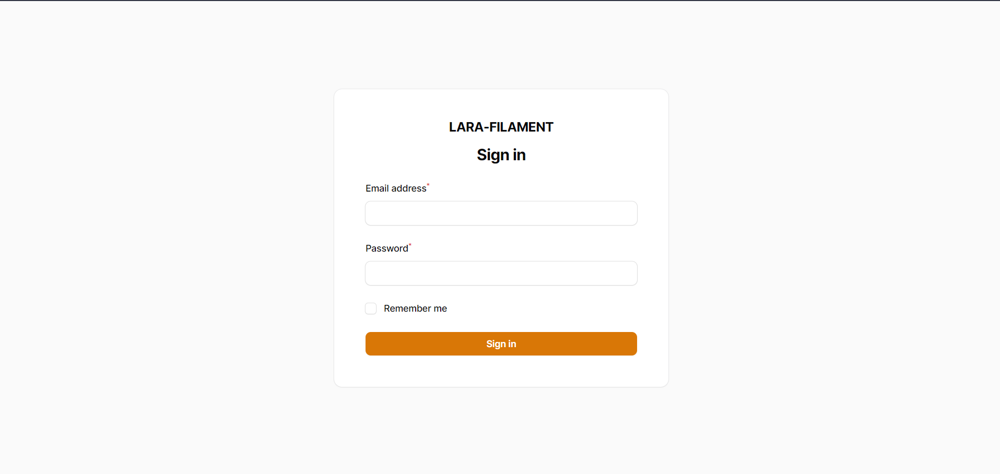
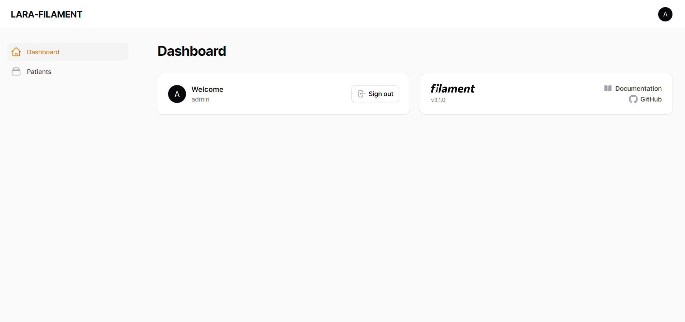
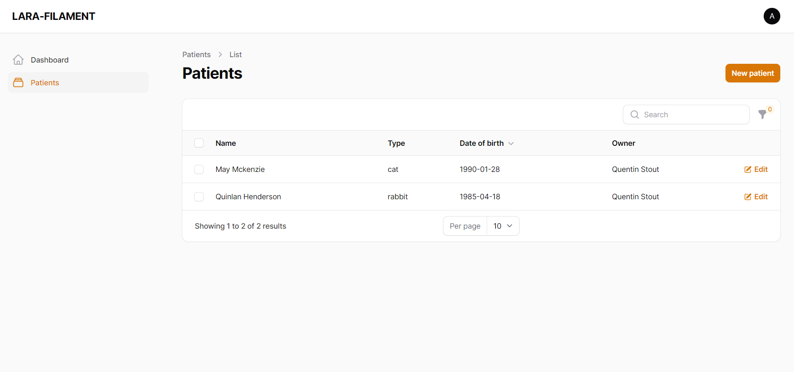
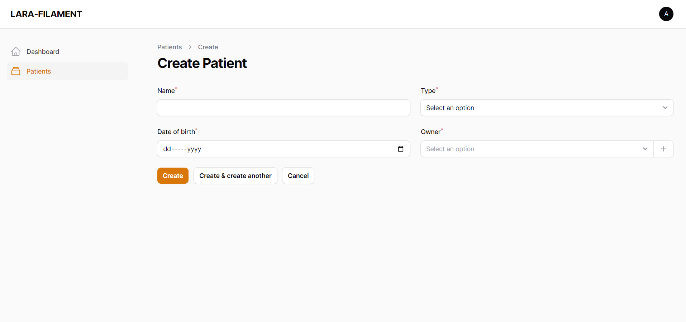
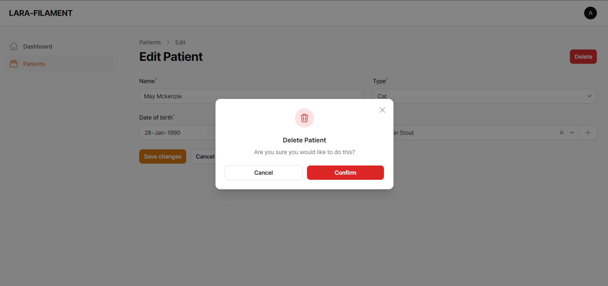
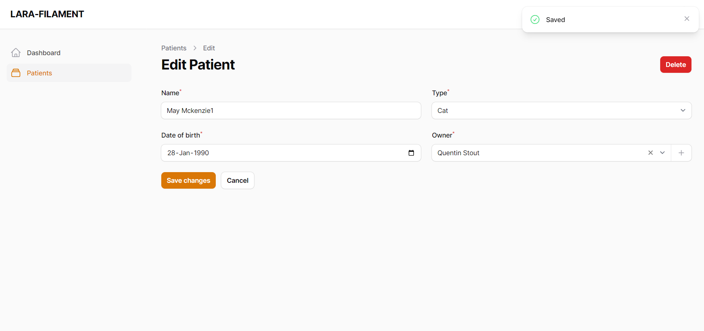

### About Project
First time I learn about Laravel Filament when they release official version 1. That time their functionalities is not many compared as now (version 3.1). So after official release V3.1, I decided to learn the package and do some simple CRM.

### Testing the CRM
I will add this CRM online right after I complete all the task.

### Links
1. https://laravel-news.com/filament
2. https://laravel-news.com/filament-3-1

### Demo
1. Login Page

2. Dashboard Page

3. Patients CRM

